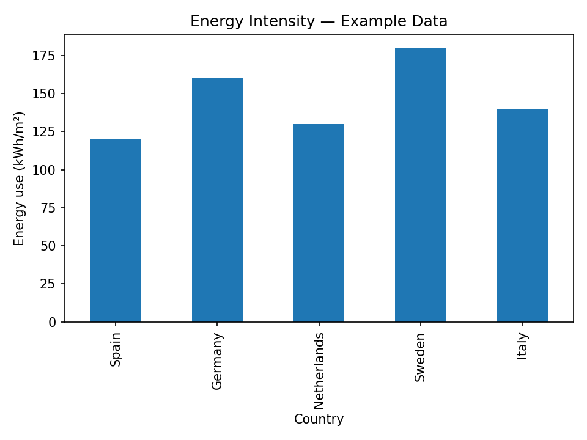
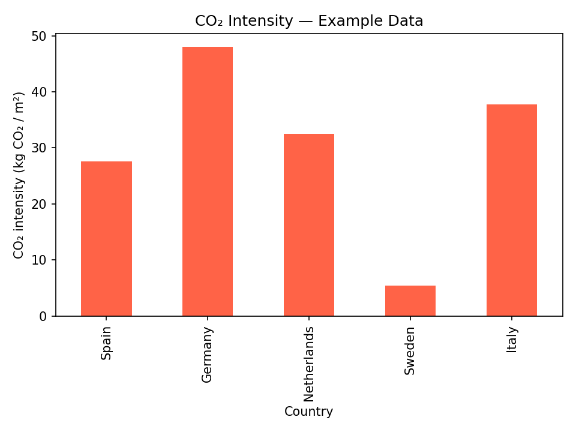

# Sustainability Data Portfolio

This repository showcases data-driven projects combining **data science** and **sustainability analytics** — with a focus on **energy performance**, **carbon intensity**, and **climate indicators** across Europe.

---

# Project — Energy & CO₂ Intensity (Europe)

# Goal
Build a simple, reproducible data pipeline to analyze energy consumption and CO₂ intensity across countries and visualize environmental performance trends.

# Objectives
- Structure a professional data-science project for sustainability.  
- Explore country-level differences in **energy intensity (kWh/m²)** and **CO₂ emissions (kg CO₂/m²)**.  
- Visualize the relationship between **climate (HDD/CDD)** and energy use.  

---

# Folder structure

02_energy_emissions_europe/
├── data/ # Source data (CSV files)
├── images/ # Generated charts
├── notebooks/ # Analysis notebooks
└── reports/ # Final outputs and markdown summaries

---

# Key Insights

From the sample dataset:

- **Highest energy intensity:** Sweden (~180 kWh/m²) due to colder climate (HDD ≈ 3800).  
- **Lowest CO₂ intensity:** Sweden (~5 kg CO₂/m²) thanks to its clean electricity mix.  
- **Highest CO₂ intensity:** Germany (~48 kg CO₂/m²) — higher grid emission factor.  
- **Takeaway:** Energy efficiency alone isn’t enough — *grid decarbonization* matters just as much.

---

## 🧩 Tech stack
- **Python (Pandas, Matplotlib)** — Data processing and visualization  
- **JupyterLab** — Interactive exploration  
- **Anaconda** — Environment and dependency management  
- **Git & GitHub** — Version control and publication

---

## 📸 Visuals
Example output generated by the notebook:

| Energy Intensity | CO₂ Intensity |
|  |  |

---

# Next Steps
- Add real datasets (e.g., Eurostat, IEA, CRREM, GHG Protocol).  
- Normalize per building type and occupancy.  
- Automate data refresh and generate PowerBI or Streamlit dashboards.  

---

# Author
**Adriano Goes**  
📍 Netherlands · 💼 MBA Data Science & Analytics  
🔗 [LinkedIn](https://www.linkedin.com/) | [GitHub](https://github.com/Adriano-goes)

---

This repository is the foundation of an evolving sustainability analytics portfolio focused on data transparency and climate performance.
